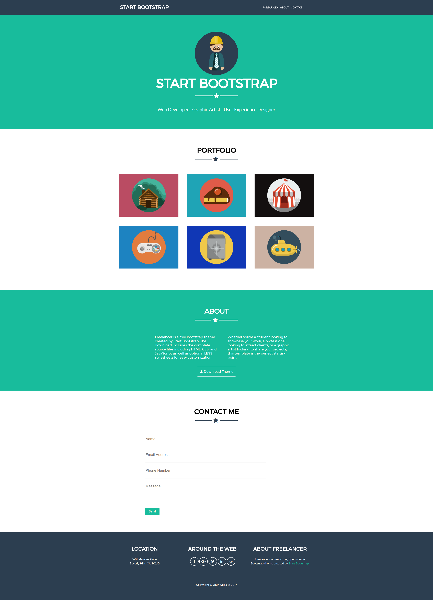

# Freelancer

* Creando un sitio web interactivo
* Maquetado web con HTML & CSS

***

## Objetivo

El reto consiste en replicar con exactitud el sitio de **Freelancer**.

## Descripción
* La  web **Freelancer** contiene:
    * Un brand (marca).
    * Un menú de navegación.
    * Imagen central con el nombre Start Bootstrap.
    * Portafolio (imagenes).
    * About (acerca de Freelancer) y un botón de descarga.
    * Contactos:
        * Nombre
        * Dirección de correo electrónico
        * Número de teléfono
        * Mensaje
    * Pie de página
        * Ubicación
        * Redes sociales
        * Descripción breve de **Freelancer** con un enlace.
***

## Herramientas
* Html 5 (Html semántico)
* Css 3
***
## Resultado final
